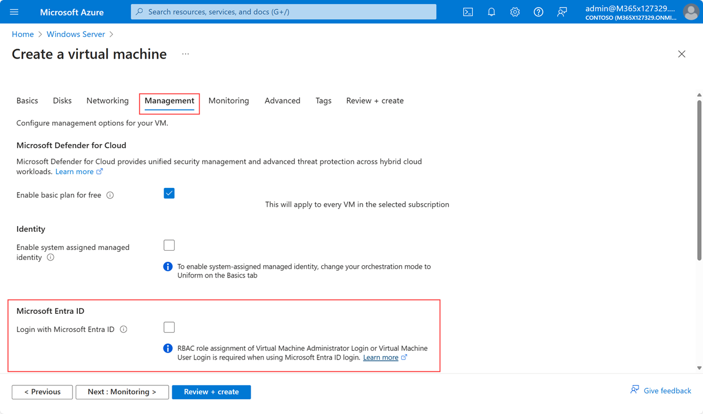

# Sign in to a virtual machine in Azure by using Microsoft Entra ID

This is document describes how to enable and perform the sign in to a VM hosted in Azure with an Entra ID account instead of using a local account.

There are some differences between Windows and Linux VMs. For both VM types, Azure RBAC configuration must be done. This could be the first step in enabling this feature.

## Azure RBAC

<!-- [ ] description of nescesary RBAC roles -->
Assign the users which should be able to sign in to the VMs interactively with their Entra Account the role

- _Virtual Machine Administrator Login_ (signed in user has local admin permissions) or
- _Virtual Machine User Login_ (signed in user has just user permissions on the guest OS.)

This is required for both Windows and Linux VMs.

## AADLogin extension for Windows

The AADLoginForWindows can only be added to VMs with the OS

- Windows Server 2019 Datacenter and later _(Server Core is not supported :exclamation:)_
- Windows 10 1809 and later
- Windows 11 21H2 and later

For more requirements read the [documentation](https://learn.microsoft.com/en-us/entra/identity/devices/howto-vm-sign-in-azure-ad-windows#requirements).

### Adding the extension for Windows

This step could be performed in Azure portal or with the Azure CLI tool.

#### Portal

It's possible to add the extension at the moment you create a new VM. In the portal check the option in section _Managment_.



> Note: Since a system assigned managed identity is required the checkbox above will be checked automatically.

Would you like to enable this feature for existing machines, ensure that the VM has a system assigned identity and then add the extension manually:

1. Navigate to the Azure VM and select in the resource menu the item _Extension + applications_.
2. Click _+ Add_
3. Search for and click the tile _Azure AD based Windows Login_
4. Click _Next_, then _Review + create_ and then _Create_

After a few moments the VM is joined to Entra ID. This could be checked in the [Entra portal](https://entra.microsoft.com/#view/Microsoft_AAD_Devices/DevicesMenuBlade/~/Devices/menuId/Devices).

#### Azure CLI

Create a VM and add the extension afterwords.

```bash
az group create --name myResourceGroup --location southcentralus
az vm create --resource-group myResourceGroup --name myVM --image Win2019Datacenter --assign-identity --admin-username azureuser --admin-password yourpassword

az vm extension set \
    --publisher Microsoft.Azure.ActiveDirectory \
    --name AADLoginForWindows \
    --resource-group myResourceGroup \
    --vm-name myVM
```

#### Additional configuration in VM

To use RDP proberly, perform the following steps:

1. Sign in to the VM as local administrator.
1. Select the Start button in the virtual machine.
1. Type Control Panel and launch the control panel app.
1. Select System and Security from the list of settings.
1. From the System setting, select the Allow remote access option.
1. At the bottom of the dialog box that opens you will see a Remote Desktop section.
1. Uncheck the box labeled Allow connections only from computers running Remote Desktop with Network Level Authentication.
1. Select Apply and then OK.
1. Exit the virtual machine RDP session.

#### Notes

Windows VMs will be Entra joined. The device name is derived from the hostname of the OS and must be unique.

Also take care, if you delete an already Entra joined VM, the device join is not deleted automatically.

### Sign in via RDP

To sign in to a Windows VM use a customized rdp file. With `mstsc.exe` create a rdp file and open it with a text editor like `notepad.exe`. At the end of that file add the following two lines:

```html
enablecredsspsupport:i:0
authentication level:i:2
```

Save the file and reopen it in `mstsc.exe`. Click connect and you should see the sign in screen of Windows and not the sign page of `mstsc.exe`.

## AADLogin extension for Linux

The extions for Linux allows you to sign in with Entra ID in SSH sessions. Use the following steps to get to know how.

### Adding the extension for Linux

Similar to Windows VMs, the exetension could be installed at the moment you create a new VM. Also you can add it to existing VMs in the portal manually.

To enable it to existing VMs with Azure CLI use the following command:

```bash
az vm extension set \
    --publisher Microsoft.Azure.ActiveDirectory \
    --name AADSSHLoginForLinux \
    --resource-group <Resource-Group-Name> \
    --vm-name <VM-Name>
```

### Sign in via SSH

To sign in you have to add an extention to Azure CLI:

```bash
az extension add --name ssh
```

Then connect to Azure Linux VM:

```bash
az login
az ssh vm -n <VM-Name> -g <Resource-Group-Name>
```

Hope that helps :wink:
