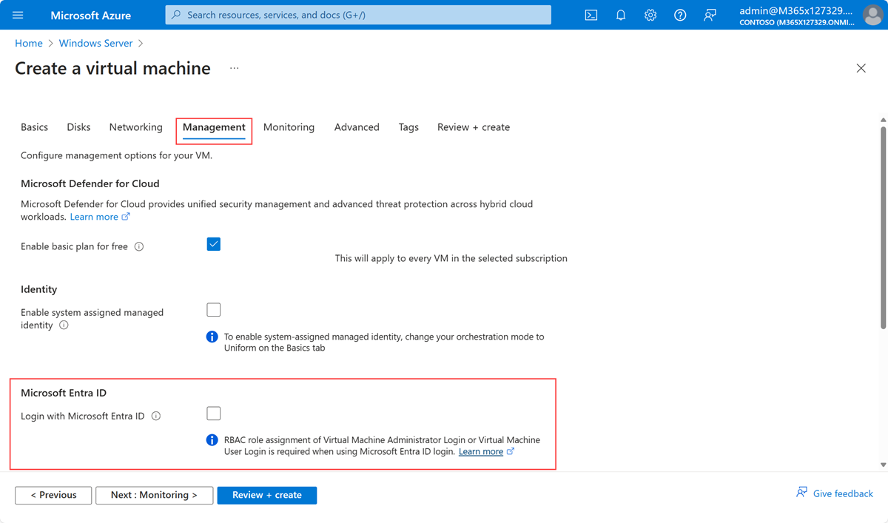

# Azure VM: Sign in with Entra ID account

This article describes how to sign in to an Azure VM with an user of Entra ID instead of a local or domain user. Microsoft's documentation for this feature can be found [here](https://learn.microsoft.com/en-us/entra/identity/devices/howto-vm-sign-in-azure-ad-windows) and for Linux VMs [here](https://learn.microsoft.com/en-us/entra/identity/devices/howto-vm-sign-in-azure-ad-linux).

---

Table of Content

+ [Windows VMs](#windows-vms)
  + [Preparation and Requirements for Windows VMs](#preparation-and-requirements-for-windows-vms)
+ [Password-less Authentication](#password-less-authentication)
  + [Password Authentication](#password-authentication)
+ [Linux VMs](#linux-vms)
  + [Preparation and Requirements for Linux VMs](#preparation-and-requirements-for-linux-vms)
  + [Sign in via SSH](#sign-in-via-ssh)

---

## Windows VMs

### Preparation and Requirements for Windows VMs

Before you are able to sign in to an Azure VM with an Entra account you have to check the supported operation system. Microsoft supports this feature at the moment on the following systems:

+ Windows Server 2019 Datacenter and later
*(Server Core is not supported :exclamation:)*
+ Windows 10 1809 and later
+ Windows 11 21H2 and later

Then check, if there's already a device in Entra ID with the same name as your Azure VM. By installing the extension ***Azure AD based Windows Login / AADLogin*** the VM will be joined. If a device with same device name as the hostname of your VM exists, the join process could not be finished. In the Audit Log of Entra ID you could see an Failure entry initiated by *Device Registration Service*. And of course, to sign in with an Entra ID account is not possible :wink:

The VM needs a system assigned managed identity to run the extension. This should be checked if you are working with an already existing VM. For newly created VMs the managed identity is created automatically if you enable Entra ID login.

For the installation of the extension ***Azure AD based Windows Login / AADLogin*** the VM must be running. It's also possible to install that extension at the moment you are creating the VM.



After you have installed the extension successfully, assign the appropriate RBAC role to your users/admin:

+ Virtual Machine Administrator Login
+ Virtual Machine User Login

For more requirements read the [documentation](https://learn.microsoft.com/en-us/entra/identity/devices/howto-vm-sign-in-azure-ad-windows#requirements).

## Password-less Authentication

Following the client-side configure is shown so you could enforce

+ multifactor Authentication
+ password-less authentication
+ device compliance state via conditional access

1. In the Azure portal, download the RDP-file for connecting to your VM.
2. Open the RDP-File in a text editor like notepad or Visual Studio Code.
3. Replace or add the following settings:

    ```code
    full address:s:VM01:3389
    enablerdsaadauth:i:1
    ```

    > Note: Instead of altering the RDP-file in an editor you could also set the advanced option *Use a web account to sign in to the remote computer* in Remote Desktop Connection tool.
4. Ensure the VM name could be successfully resolved. Maybe you have to change DNS or your hosts file.
5. Save the file and double click it to connect.
6. Sign in with Entra ID user principal name. If there are any issues, use the format *AzureAD\\user\@domain.com*.

### Password Authentication

This configuration shows you the client-side configuration so you could use the windows logon screen for signing in.

>Note::exclamation:Important: The device, from which you initiate a RDP connection an Azure VM must be a Windows 10 or later device, which is also either Microsoft Entra registered (minimum required build is 20H1) or Microsoft Entra joined or Microsoft Entra hybrid joined to the same directory as the VM:exclamation:

1. In the Azure portal, download the RDP-file for connecting to your VM.
2. Double click it to connect.
3. Sign in with your user principal name. If there are any issues, use the format *AzureAD\\user\@domain.com*.

> Note: In this case you could use the IP address of your machine and not necessarily the hostname.

## Linux VMs

### Preparation and Requirements for Linux VMs

The extensions for Linux allows you to sign in with Entra ID in SSH sessions. Use the following steps to get to know how.

Similar to Windows VMs, the extension could be installed at the moment you create a new VM. Also you can add it to existing VMs in the portal manually.

To enable it to existing VMs with Azure CLI use the following command:

```v
az vm extension set \
    --publisher Microsoft.Azure.ActiveDirectory \
    --name AADSSHLoginForLinux \
    --resource-group <Resource-Group-Name> \
    --vm-name <VM-Name>
```

For more information read [Microsoft documentation](https://learn.microsoft.com/en-us/entra/identity/devices/howto-vm-sign-in-azure-ad-linux#meet-requirements-for-login-with-microsoft-entra-id-using-openssh-certificate-based-authentication).

### Sign in via SSH

To sign in you have to add an extension to Azure CLI:

```v
az extension add --name ssh
```

Then connect to Azure Linux VM:

```v
az login
az ssh vm -n <VM-Name> -g <Resource-Group-Name>
```

Hope that helps :wink:
